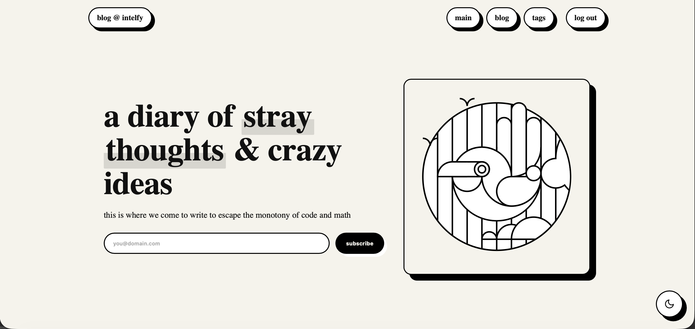

# neo-brutalics
a neo-brutalist, work-in-progress theme for Ghost, designed specifically for the intelfy.dk blog but shared with you for free.

I can't be bothered to write an entire readme for this, so check out the full write-up here: https://blog.intelfy.dk/dev-block-made-theme/ (contains a download .zip, but you could also just clone this repository locally and zip and install)

Download the latest release here: https://github.com/TomKonig/neo-brutalics/releases

unreleased hotfixes:
- upped the font-weight on universal headings for a better look
- post hero now displays as block (title on top, pic below) on mobile